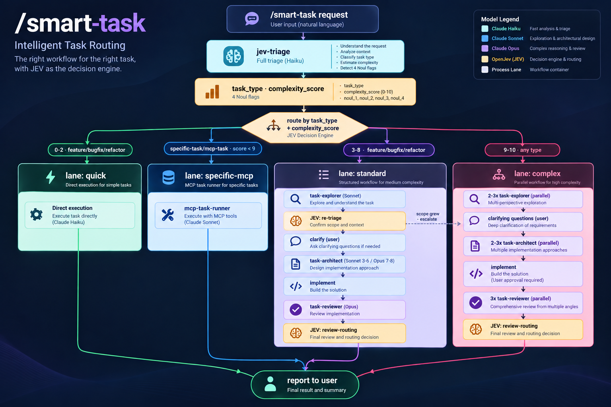
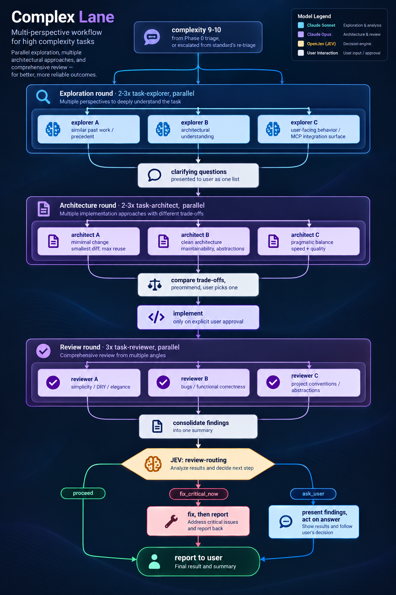
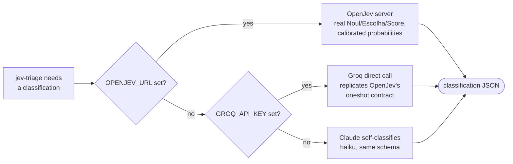

# smart-task — JEV-routed multi-agent development

A Claude Code plugin that adds `/smart-task`: a multiuse task command that classifies every request first (feature, bugfix, specific task, or MCP task, at a 0–10 complexity score) and only then decides how much pipeline to run and which model tier (Haiku / Sonnet / Opus) does the work. Trivial requests stay cheap and fast; genuinely complex ones get the full multi-agent treatment.

The triage step is inspired by [JEV](https://shop.zimaspace.com/pt/blogs/tech-ai-hub/what-is-jev-ai-decision-model-agents) — TypeSafe AI's "System One"-style decision model pattern: instead of free-form generation, a decision layer answers typed, bounded questions using three primitives:

| Primitive | What it returns | Used here for |
|---|---|---|
| **Noul** | bounded yes/no with confidence | `needs_clarification`, `needs_mcp`, `needs_multiagent`, `high_stakes` |
| **Escolha** (choice) | selection among predefined options | `task_type`, and mid-pipeline `review_outcome` |
| **Pontuação** (score) | scored evaluation on a scale | `complexity_score` (0–10) |

Triage isn't a one-shot gate — the `standard`/`complex` lanes call the decision layer twice more mid-pipeline (once after exploration to catch under-scoped tasks, once after review to route the outcome), so cheap structured decisions keep displacing free-form Sonnet/Opus reasoning throughout the run, not just at the start. See [Lanes](#lanes) below.

TypeSafe's own Jev is a paid, closed, hosted service. This plugin instead defaults to a self-contained decision layer (Claude on Haiku), with an optional real external decision layer plugged in — see [Optional: external decision layer](#optional-external-decision-layer-openjev--groq) below.

## Architecture



Color legend: cyan = Haiku, blue = Sonnet, purple = Opus, amber = a JEV decision point (external OpenJev/Groq or Claude self-classification — see below).

### Inside the `complex` lane

The overview above collapses "2-3x task-explorer" and "2-3x task-architect" into single boxes. Each parallel instance in a round actually has a different, named focus — they aren't 2-3 copies of the same prompt. Zoomed in:




Each round runs its 2-3 (or, for review, always 3) agents **in parallel**, not sequentially — the round only advances once every agent in it has returned. The specific focuses (minimal change / clean architecture / pragmatic balance, and so on) are defined in `commands/smart-task.md`'s `complex` lane instructions, not hardcoded into the agent files themselves — `task-explorer.md`/`task-architect.md`/`task-reviewer.md` are generic, and the command gives each parallel launch its distinct angle via the prompt.

## Install

```bash
# from the plugin marketplace, once published
/plugin install smart-task

# or locally, for development
claude --plugin-dir /path/to/claude-multiagent-coding
```

## Usage

```
/smart-task rename getUser to fetchUserById across the repo
/smart-task add multi-tenant billing with per-tenant currency support
/smart-task create a Trello card for this bug in the Doing list
```

Every invocation starts with the `jev-triage` agent, which prints a one-line classification (`task_type`, `complexity_score`, lane, model) before doing anything else — that line is the audit trail for why the task got the effort level it got. You can override the recommendation explicitly ("faz isso rápido, sem cerimônia" / "quero o pipeline completo mesmo sendo simples").

## Lanes

| Lane | When | Pipeline | Model(s) |
|---|---|---|---|
| `quick` | complexity 0–2, or light `research` | main thread, no sub-agents | inherited |
| `specific-mcp` | `specific-task` / `mcp-task`, or deep `research` | one focused agent (`mcp-task-runner` or direct) | Sonnet, Opus if high-stakes |
| `standard` | complexity 3–8 | explore → **re-triage (JEV)** → clarify → design → implement → review → **route outcome (JEV)** | Sonnet, Opus for architecture at 7–8 |
| `complex` | complexity 9–10 | 2–3 parallel explorers → clarify → 2–3 parallel architects → implement → 3 parallel reviewers → **route outcome (JEV)** | Sonnet for exploration, Opus for architecture + review |

Full routing tables and rationale: [`skills/jev-decision-model/references/model-routing.md`](skills/jev-decision-model/references/model-routing.md).

## Components

- **`commands/smart-task.md`** — the entry point; runs triage, then the matching lane.
- **`agents/jev-triage.md`** — the decision layer (Haiku). Classifies `task_type`, `complexity_score`, and four Noul flags at the start of every task, then handles two more mid-pipeline checkpoints (re-triage, review-routing) in the `standard`/`complex` lanes.
- **`agents/task-explorer.md`**, **`agents/task-architect.md`**, **`agents/task-reviewer.md`** — the `standard`/`complex` lane pipeline (Sonnet/Opus).
- **`agents/mcp-task-runner.md`** — focused executor for MCP-centric tasks (Sonnet, escalates to Opus for high-stakes actions).
- **`skills/jev-decision-model/`** — the taxonomy, decision contract, and routing tables the agents above are built on.
- **`scripts/jev-decide.sh`** — optional external decision-layer client (OpenJev / Groq); see below.

## Optional: external decision layer (OpenJev / Groq)

By default, triage runs entirely inside Claude (Haiku) — no setup needed. If you'd rather use a real, open-source JEV-style decision engine for the triage step, `jev-triage` will use it automatically when configured — this is the "amber box" from the diagram above, expanded:



1. **[OpenJev](https://github.com/SiliconLabAI/OpenJev)** (MIT, by SiliconLabAI) — an open reimplementation of the same "state + typed questions → structured answers" pattern with `choice`/`score`/`noul` primitives, LLM-backed. Run it locally:
   ```bash
   git clone https://github.com/SiliconLabAI/OpenJev.git && cd OpenJev
   npm install && cp .env.example .env   # set OPENAI_API_KEY (or GROQ_API_KEY + OPENAI_BASE_URL)
   npm run dev                            # serves POST /api/evaluate on :3001
   ```
   Then set `OPENJEV_URL=http://localhost:3001` before invoking `/smart-task`.

2. **Groq directly** — if you don't want to run a separate server, set `GROQ_API_KEY` (get one at [console.groq.com](https://console.groq.com/keys)) and optionally `GROQ_MODEL` (default `openai/gpt-oss-20b`; check `curl https://api.groq.com/openai/v1/models -H "Authorization: Bearer $GROQ_API_KEY"` for what's currently live, since Groq's catalog changes). `scripts/jev-decide.sh` calls Groq's OpenAI-compatible API directly, replicating OpenJev's own "oneshot" prompt/response contract — no server to run. Groq's low latency keeps this consistent with the "decide small, execute big" principle the whole plugin is built on.

   **Known limitation, tested live**: this path is a single call to a small model in "oneshot" mode, so `complexity_score` calibration can vary noticeably between otherwise-identical runs (observed: the same rename request scored 3/10 once and 7/10 on a repeat run). `task_type`/`needs_*` classification was consistently correct across our tests. If tight score calibration matters more than zero setup, prefer OpenJev's `parallel` mode (per-option calibrated probabilities via multiple small calls) over Groq oneshot, or rely on the Claude self-classification fallback.

3. **Neither set** → automatic fallback to Claude self-classification. This is the default, not a degraded mode.

Copy [`.env.example`](.env.example) to `.env` in the plugin root. `scripts/jev-decide.sh` reads it fresh on every call (only an already-exported real environment variable takes precedence), so editing `.env` takes effect on the very next `/smart-task` invocation — no session restart needed.

**If you installed via a plugin marketplace** (`/plugin install smart-task@...`), be aware that install copies the plugin's files — including `.env` — into an isolated cache under `~/.claude/plugins/cache/<marketplace>/smart-task/<version>/`. Editing `.env` in your original source checkout does **not** update that cache automatically; re-run `/plugin install` (or your marketplace's update/reload command) after changing `.env` so the cached copy picks up the change.

> **Naming note**: there is also an unrelated site, `openjev.com` (now renamed "SemIf"), which is a browser-only local-LLM demo with no SDK/API — not the same project as `SiliconLabAI/OpenJev` on GitHub, and not usable here. This plugin integrates with the GitHub project.

## Credits

- [TypeSafe AI](https://shop.zimaspace.com/pt/blogs/tech-ai-hub/what-is-jev-ai-decision-model-agents) — the Jev decision-model pattern this plugin is inspired by.
- [SiliconLabAI/OpenJev](https://github.com/SiliconLabAI/OpenJev) — the open-source implementation this plugin optionally integrates with.
- [Mapika/decider](https://github.com/Mapika/decider) — the open System One model family OpenJev can also serve from.
- Command/agent pipeline structure adapted from this author's personal `/feature-dev` command.

## License

MIT — see [LICENSE](LICENSE).
